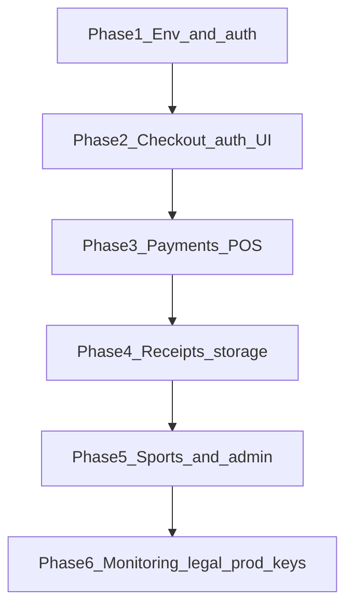

# OB Pre-Launch Audit & Implementation Plan

Audit of **The Owner's Box** (`apps/native` + `convex` + `apps/web`) for issues real users will hit before production.

**Legend:** P0 = blocks trust/safety/revenue · P1 = major UX/data · P2 = polish · P3 = later

---

## P0 — Must fix before real customers

### 1. Payments are mocked (orders not charged)

- **Issue:** [`AddCardScreen.tsx`](apps/native/src/screens/AddCardScreen.tsx) uses `mockTokenize()`; [`convex/orders.ts`](convex/orders.ts) logs mock Xenial POS — no real charge.
- **User impact:** Orders “succeed” in app but kitchen/POS may never see them; cards are fake tokens.
- **Plan:**
  1. Integrate GeniuS/Xenial SDK (tokenize client-side only).
  2. Pass `gatewayToken` + selected payment method into `placeOrder` (extend mutation).
  3. Convex action to submit order to POS; update `paymentStatus` / `status` from webhook or poll.
  4. Block checkout UI until payment method selected when total > 0.

### 2. Checkout does not require sign-in or payment

- **Issue:** [`CartScreen.tsx`](apps/native/src/screens/CartScreen.tsx) `handleCheckout` calls `placeOrder` without `ensureAuth` or card validation.
- **User impact:** Guest checkout may fail server-side with opaque `alert()`; or authenticated user places order with no payment.
- **Plan:**
  1. Wrap checkout with `ensureAuth` (same pattern as rewards).
  2. Require saved card or Apple/Google Pay before submit.
  3. Replace `alert()` with in-app error UI + retry.

### 3. Receipt upload is fake

- **Issue:** [`UploadReceiptScreen.tsx`](apps/native/src/screens/UploadReceiptScreen.tsx) sends `imageUrl: "placeholder_image_url"`; camera is mock `Alert`.
- **User impact:** Users think they earned points; admins see useless submissions.
- **Plan:**
  1. `expo-image-picker` + Convex file storage (`generateUploadUrl`).
  2. Store real `storageId` / URL on `receipt_submissions`.
  3. Disable submit until image attached.

### 4. Clerk production + Convex auth

- **Issue:** Test Clerk keys in `.env.local`; `CLERK_ISSUER_URL` must match deployment.
- **User impact:** Login works in dev, breaks or uses wrong tenant in prod.
- **Plan:**
  1. Production Clerk app + JWT template `convex`.
  2. Rotate `EXPO_PUBLIC_*` / `NEXT_PUBLIC_*` / `CLERK_SECRET_KEY`.
  3. Set `CLERK_ISSUER_URL` on **production** Convex deployment.

### 5. Admin access is brittle

- **Issue:** [`convex/lib/requireAdmin.ts`](convex/lib/requireAdmin.ts) hardcoded `ADMIN_IDS` + Clerk `role` metadata.
- **User impact:** Wrong people get admin or real admins locked out.
- **Plan:**
  1. Move admin list to Convex env or `admin_users` table.
  2. Document Clerk `publicMetadata.role = "admin"` setup.
  3. Remove hardcoded user IDs before launch.

---

## P1 — High impact soon after launch

### 6. Sports data — redundant free sources (not a Sportradar blocker)

- **Already built:** [`convex/sports/fallback_sync.ts`](convex/sports/fallback_sync.ts) tries Sportradar → API-Sports → **TheSportsDB (free, no key)**. Cron: `scheduledSyncWithFallback`. With **no** `SPORTRADAR_*` keys, tier 1 fails fast and TSDB still populates War Room for major leagues.
- **Direction:** Replace tier 1 with **ESPN** (free public scoreboards) instead of Sportradar — see [`convex/sports/ESPN_MIGRATION.md`](convex/sports/ESPN_MIGRATION.md) and [`convex/sports/README.md`](convex/sports/README.md).
- **User impact:** Empty War Room usually means sync cron not running or all three tiers failed for that date/sport — not “missing Sportradar subscription.”
- **Plan:** ESPN-first waterfall; optional `API_SPORTS_KEY` (free tier); never require Sportradar keys.

### 7. Menu/product queries are public

- **Issue:** [`convex/products.ts`](convex/products.ts) has no auth (OK for menu) but no `isAvailable` / stock filter for out-of-stock items.
- **Plan:** Filter `isAvailable !== false` in queries; wire admin toggles from web.

### 8. Order status never updates after “pending”

- **Issue:** Orders stay `pending` / `paymentStatus: pending` after mock POS.
- **Plan:** Web admin [`admin_orders`](convex/admin_orders.ts) + push notifications when status changes.

### 9. Legal copy placeholder

- **Issue:** Terms/Privacy screens likely template text.
- **Plan:** Legal review → update [`TermsScreen.tsx`](apps/native/src/screens/TermsScreen.tsx) / [`PrivacyPolicyScreen.tsx`](apps/native/src/screens/PrivacyPolicyScreen.tsx).

### 10. No crash/error monitoring

- **Issue:** No Sentry/PostHog in native app.
- **Plan:** Add Sentry Expo plugin + source maps; optional PostHog product events.

### 11. Identity key consistency

- **Issue:** Backend uses `identity.subject` everywhere; Convex guidelines prefer `tokenIdentifier` for stable lookups.
- **Plan:** Audit `user_profiles.userId` and migrations to `tokenIdentifier` if Clerk subject ever changes format.

---

## P2 — Polish & operations

| Item | Notes |
|------|--------|
| Kitchen hours | Implemented client-side in cart only — enforce on server in `placeOrder` |
| Tax rate | Hardcoded `0.0825` in cart — move to config |
| Location | Hardcoded Greenville address in checkout |
| Rewards images | Many use `placeholder_reward.png` |
| Notes feature | Template leftover in repo (`notes.ts`, screens) — remove or hide from nav |
| EAS Android | No dev/production Android builds in Expo dashboard yet (iOS only history) |
| Schema | Commit `logoUrlSmall` / `draws` to git (already deployed locally) |

---

## P3 — Roadmap (from PRODUCTION_READY.md)

Push notifications, birthday automation, Apple/Google Pay, email receipts, store hours admin, social sharing.

---

## Suggested implementation order

1. **Week 1:** Env vars (below), Clerk prod, commit schema, sign-in gated checkout, better errors.
2. **Week 2:** Payment tokenization + POS action; order status pipeline.
3. **Week 3:** Receipt upload + admin review flow.
4. **Week 4:** Sports API keys, empty states, Sentry, legal, Android EAS build.

---

## Environment variables

See commented keys in:

- [`/.env.local`](.env.local) — Convex CLI
- [`apps/native/.env.local`](apps/native/.env.local) — Expo client
- [`apps/web/.env.local`](apps/web/.env.local) — Next.js client
- [`convex/ENV_KEYS.md`](convex/ENV_KEYS.md) — server-side Convex deployment keys

**You can run the app without:** OpenAI, Sportradar, or API-Sports keys (TheSportsDB free fallback). ESPN-as-primary improves quality when merged.

**You cannot run authenticated flows without:** `EXPO_PUBLIC_CONVEX_URL`, `EXPO_PUBLIC_CLERK_PUBLISHABLE_KEY`, `CLERK_ISSUER_URL` on Convex deployment.
