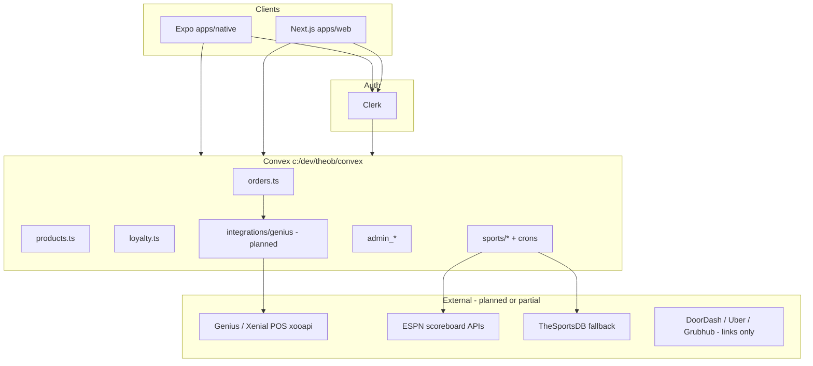
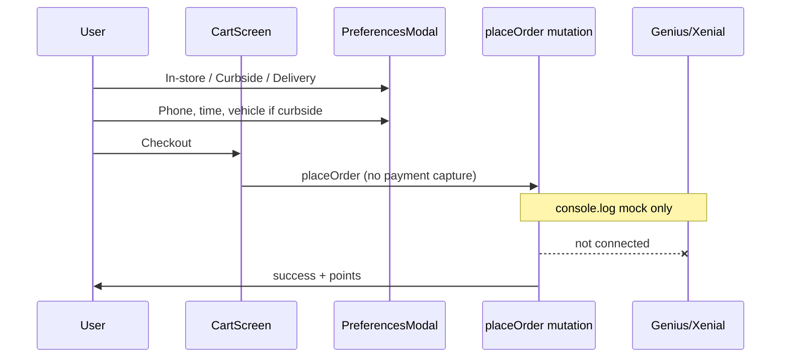
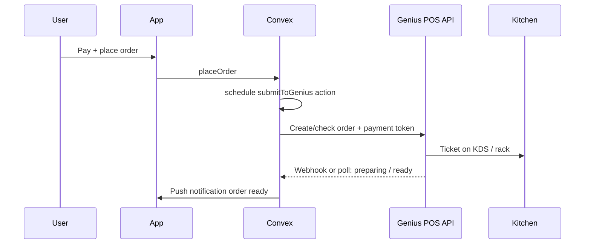

# The Owner's Box — Systems Architecture

Single-location MVP: **Greenville, SC** (`greenville_01`). Multi-location later.

## High-level diagram

## Repositories in this monorepo

| Path | Role |
|------|------|
| [`apps/native`](../apps/native) | Customer mobile app (ordering, loyalty, games) |
| [`apps/web`](../apps/web) | Marketing + admin dashboard |
| [`convex`](../convex) | API, database, crons, future POS actions |
| [`packages/backend`](../packages/backend) | Legacy stub — **do not use** |

## Data domains

| Domain | Tables / modules | Client surfaces |
|--------|------------------|-----------------|
| Menu | `categories`, `products` | MenuScreen, web menu |
| Cart | Local AsyncStorage + `CartContext` | CartScreen |
| Fulfillment prefs | `OrderContext` AsyncStorage | PreferencesModal, OrderHeader |
| Orders | `orders` | Cart checkout, OrderHistory, admin |
| Payments | `payment_methods` | AddCard, SavedCards — **mock tokenize today** |
| Loyalty | `user_profiles`, `points_ledger`, `reward_definitions` | Rewards, CollectPoints |
| Sports | `upcoming_games` | LiveGamesScreen |
| Admin | `admin_*` | web `/admin` |

## Order / pickup flow (today)

## Order / pickup flow (target)

## Greenville location (canonical)

See [`convex/lib/locations.ts`](../convex/lib/locations.ts).

## Genius / Xenial naming

In code and comments we use **GeniuS/Xenial** (Heartland / Global Payments restaurant platform). Restaurant staff may call it **Genius POS**. Integration doc: [`convex/integrations/genius/README.md`](../convex/integrations/genius/README.md).

## Production gaps (prioritized)

See [`OB_PRE_LAUNCH_PLAN.md`](../OB_PRE_LAUNCH_PLAN.md) and [`docs/GENIUS_POS_ROADMAP.md`](GENIUS_POS_ROADMAP.md).
